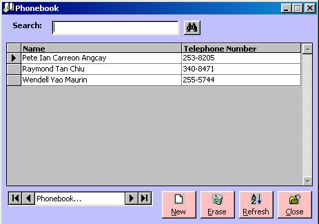

<div align="center">

## ADO Public Connection and ADO Data Control


</div>

### Description

Shows how ADO technology connects globaly. Also shows how to integrate ADO Data Control and the Data Grid. This project uses the phonebook concept to show these concepts.
 
### More Info
 
Optional ByVal WhereStr As String, this is just a String to add to a query for searching.

Check all references and components. Check if your Visual Basic has updated DCOM and MDAC. And Extract these files into a single folder.


<span>             |<span>
---                |---
**Submitted On**   |2001-07-11 11:41:04
**By**             |[Raymond T\. Chiu](https://github.com/Planet-Source-Code/PSCIndex/blob/master/ByAuthor/raymond-t-chiu.md)
**Level**          |Advanced
**User Rating**    |4.8 (43 globes from 9 users)
**Compatibility**  |VB 6\.0
**Category**       |[Databases/ Data Access/ DAO/ ADO](https://github.com/Planet-Source-Code/PSCIndex/blob/master/ByCategory/databases-data-access-dao-ado__1-6.md)
**World**          |[Visual Basic](https://github.com/Planet-Source-Code/PSCIndex/blob/master/ByWorld/visual-basic.md)
**Archive File**   |[ADO Public225377102001\.zip](https://github.com/Planet-Source-Code/raymond-t-chiu-ado-public-connection-and-ado-data-control__1-24894/archive/master.zip)

### API Declarations

```
Private Declare Function ShellExecute Lib "shell32.dll" Alias "ShellExecuteA" (ByVal hwnd As Long, ByVal lpOperation As String, ByVal lpFile As String, ByVal lpParameters As String, ByVal lpDirectory As String, ByVal nShowCmd As Long) As Long
```


